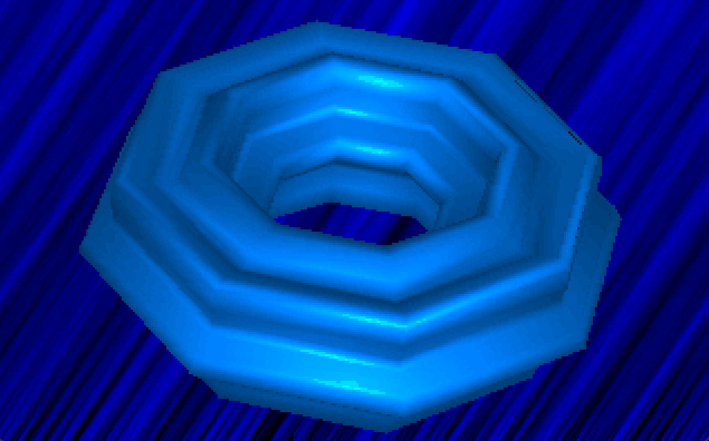

Released at The Party 5
By Elliot from Epsilon (c) 1995.

Notes:
- there was no 4kb category unfortunately.
- it was mostly an updated form of lion, with a warped rotozoom and an autogenerated torus that morphed
- you can run this on modern hardware/operating-systems with dosbox (among others).

https://www.demoparty.net/the-party/the-party-5

